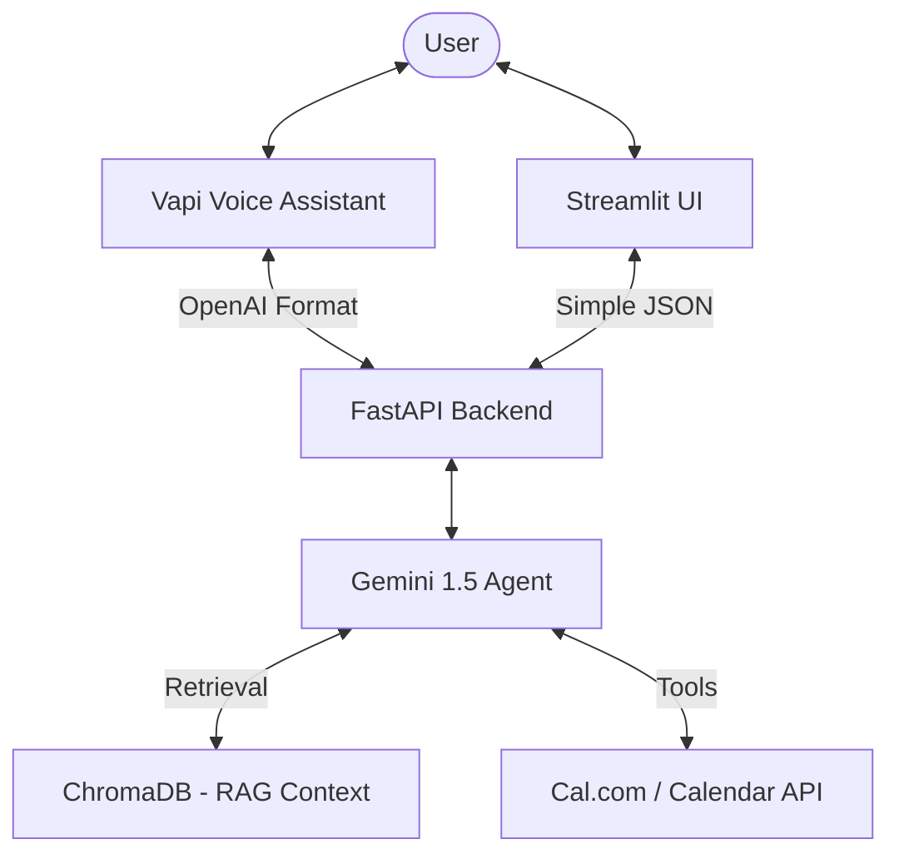
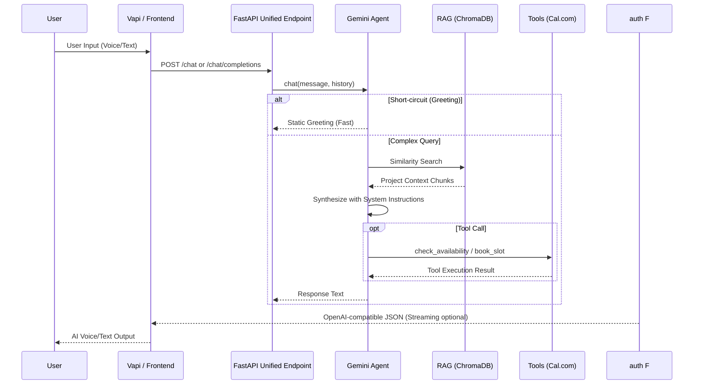

# AI Persona Agent 🤖

An autonomous, voice-enabled AI representative built using **Gemini 2.5 Flash**, **RAG (Retrieval-Augmented Generation)**, and **FastAPI**. This agent speaks on behalf of a software engineer, answering questions about projects, tech stack, and experience, while also handling real-time meeting scheduling.

## 🏗️ System Architecture

### High-Level Flow


### Request Lifecycle


---

## 🚀 Key Features

- **Unified API Gateway**: A single backend supporting both standard OpenAI-compatible requests (for Vapi/Voice) and simplified requests (for the Streamlit UI).
- **RAG-Powered Knowledge**: Ingests resumes, repos, and documentation into a ChromaDB vector store for accurate, non-hallucinated answers.
- **Voice-First Design**: Custom LLM integration for Vapi.ai with support for word-by-word streaming to minimize latency.
- **Autonomous Tooling**: Function calling for real-time meeting availability checks and slot booking via Cal.com.
- **Performance Optimizations**:
    - **Short-circuiting**: Instant responses for greetings to save LLM tokens and reduce latency.
    - **Dynamic RAG**: Skips vector search for very short messages to keep interactions snappy.

---

## 🛠️ Tech Stack

- **Large Language Model**: Google Gemini 2.5 Flash
- **Backend Framework**: FastAPI (Python)
- **Frontend UI**: Streamlit
- **Vector Database**: ChromaDB
- **Embedding Model**: Google Generative AI Embeddings
- **Deployment**: Render / Streamlit Cloud

---

## 📦 Project Structure

```text
.
├── agent/
│   ├── gemini_agent.py     # Core agent logic & tool definitions
│   ├── retriever.py        # ChromaDB setup & RAG retrieval
│   ├── ingest.py          # Data ingestion pipeline
│   └── calendar_tools.py   # Cal.com API integrations
├── api/
│   └── main.py             # FastAPI entry point (Unified Endpoint)
├── chat_ui/
│   └── app.py              # Streamlit frontend dashboard
├── data/                   # Raw documents for RAG (Resume, Repo files)
└── chroma_db/              # Locally persisted vector database
```

---

## ⚡ Setup & Installation

1.  **Environment Setup**:
    ```bash
    python -m venv .venv
    source .venv/bin/activate
    pip install -r requirements.txt
    ```

2.  **Configuration**:
    Create a `.env` file based on `.env.example`:
    ```env
    GEMINI_API_KEY=your_key
    CALCOM_API_KEY=your_key
    OWNER_NAME=Daksh
    ```

3.  **Data Ingestion**:
    Place documents in `/data` and run:
    ```bash
    python agent/ingest.py
    ```

4.  **Running the App**:
    ```bash
    # Start Backend
    uvicorn api.main:app --host 0.0.0.0 --port 8000
    
    # Start Frontend
    streamlit run chat_ui/app.py
    ```

---

## 📡 API Reference

### Unified Chat Endpoint
`POST /chat` or `POST /chat/completions`

**OpenAI Format (Used by Vapi):**
```json
{
  "model": "gpt-4.1",
  "messages": [{"role": "user", "content": "How's your project?"}],
  "stream": true
}
```

**Simple Format (Used by UI):**
```json
{
  "message": "Tell me about EduCast",
  "history": []
}
```

---

*Built with ❤️ for the Scaler Screening Assignment.*
